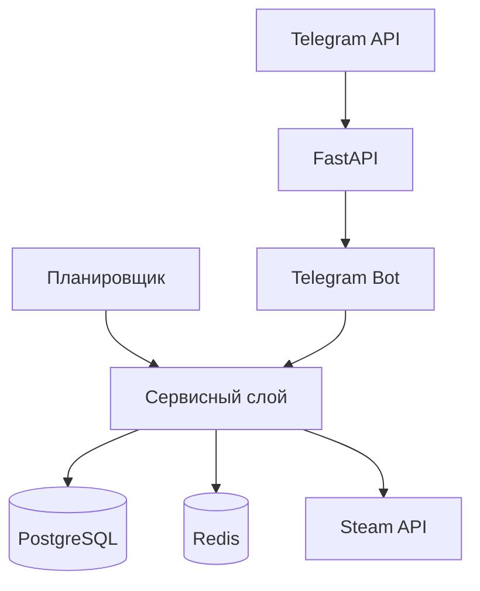

# 💸 CSItemStat Bot — Трекер цен Steam в Telegram

<p align="center">
  
  
  
  
  
  
  
  
</p>

> **CSItemStat Bot** — это Telegram‑бот для отслеживания цен на предметы из инвентаря Steam. Он помогает трейдерам и коллекционерам всегда быть в курсе рыночной ситуации: отображает актуальные цены, строит графики, присылает уведомления о резких изменениях и регулярные дайджесты со статистикой.

<p align="center">
  
</p>

## ✨ Основные возможности

| Функциональность | Описание |
|---------|----------|
| 🎒 **Инвентарь Steam** | Загружайте инвентарь, группируйте по предметам и добавляйте в персональный портфель. |
| 📊 **Графики цен** | Просматривайте историю цен за 7, 30, 90 дней или всё время. |
| ⏰ **Ценовые алерты** | Получайте уведомления, когда цена изменяется на заданный процент (за 24h или 7d). |
| 📬 **Дайджесты** | Ежедневные или еженедельные сводки по каждому отслеживаемому предмету. |
| 📈 **Тренды** | Автоматический расчёт направления тренда (восходящий / нисходящий / стабильный) на основе линейной регрессии. |
| 💾 **Кэширование** | Графики и инвентарь кэшируются в Redis для мгновенной загрузки. |

## 🛠️ Технологический стек

| Категория | Технологии |
|-----------|------------|
| **Язык** | Python 3.12 |
| **Веб-фреймворк** | FastAPI + Uvicorn |
| **База данных** | PostgreSQL 15 (SQLAlchemy 2.0 async) |
| **Кэш** | Redis 7 (aioredis) |
| **Telegram Bot** | aiogram (webhook) |
| **Steam API** | aiosteampy (авторизация через Steam Guard) |
| **Визуализация** | Matplotlib, Seaborn |
| **Статистика** | NumPy, SciPy, Pandas |
| **Контейнеризация** | Docker, Docker Compose |
| **CI/CD** | GitHub Actions (тесты, линтеры) |
| **Тестирование** | pytest, pytest-asyncio |

## 🧠 Архитектурная схема



## ⚙️ Установка и запуск

### Предварительные требования
- Python 3.12
- Docker & Docker Compose (опционально)
- Telegram Bot Token (получить у [@BotFather](https://t.me/BotFather))
- Steam аккаунт с файлом [`.maFile`](https://github.com/Jessecar96/SteamDesktopAuthenticator) (для авторизации через Steam Guard)

### Локальный запуск с Docker Compose

```bash
# Клонировать репозиторий
git clone https://github.com/neygenius/tgbot.git
cd steam_market_tracker

# Создать и активировать виртуальное окружение
python -m venv venv
source venv/bin/activate  # Windows: venv\Scripts\activate

# Установить зависимости
pip install -r requirements.txt

# Создать файл .env и заполнить все обязательные переменные (пример в .env.example)
cp .env.example .env

# Поднять PostgreSQL и Redis
docker-compose up -d

# Запустить приложение (веб-сервер)
python run.py
```

> После запуска бот автоматически установит вебхук для приёма обновлений от Telegram. Для локального тестирования без публичного домена используйте [Cloudflare Tunnel](https://developers.cloudflare.com/tunnel/) или аналоги

## 🤖 Команды бота

| Команда | Описание |
|---------|----------|
| `/start` | Регистрация пользователя и приветствие |
| `/help` | Справка по командам |
| `/link_steam <steam_id64>` | Привязка Steam ID к профилю (шифруется в БД) |
| `/inventory` | Показать ваш инвентарь Steam (с пагинацией) |
| `/bagpack` | Управление отслеживаемыми предметами (подписки, алерты, удаление) |
| `/track <название>` | Найти и добавить предмет в портфель |
| `/stats <название>` | Показать статистику и график цены для предмета |

> Все действия с подписками и алертами выполняются через инлайн‑кнопки внутри `/bagpack` и `/stats`.

---

## 🧪 Тестирование

### На данный момент проект покрыт unit тестами на ~90% и интеграционными на ~48%.

Для запуска тестов:

```bash
# Установить тестовые зависимости (если ещё не установлены)
pip install pytest pytest-asyncio

# Запустить все тесты
pytest -v

# Запустить с отчётом о покрытии
pytest --cov=app tests/
```

> e2e тесты находятся в процессе разработки...

---

## 📁 Структура проекта (кратко)

```
steam_market_tracker/
├── app/
│   ├── main.py              # FastAPI приложение, lifespan, webhook
│   ├── config.py            # Pydantic настройки из .env
│   ├── state.py             # Глобальные объекты
│   ├── db/                  # Модели SQLAlchemy
│   ├── services/            # Бизнес-логика: сбор цен, статистика, графики, уведомления
│   ├── bot/                 # Telegram‑бот: диспетчер, клавиатуры, сообщения, очистка
│   ├── scheduler/           # Планировщик APScheduler
│   └── utils/               # Вспомогательные утилиты
├── tests/                   # Интеграционные и unit тесты
├── docker-compose.yaml      # Управление контейнерами PostgreSQL и Redis
├── requirements.txt         # Зависимости
├── requirements-dev.txt     # Зависимости для тестов и линта
└── .env.example             # Пример переменных окружения
```

## 🔧 Переменные окружения (`.env`)

| Переменная | Описание |
|---|---|
| `BOT_TOKEN` | Токен Telegram-бота |
| `WEBHOOK_SECRET` | Секретный токен для вебхука (проверка заголовка) |
| `WEBHOOK_URL` | Публичный URL вашего сервера (например, `https://example.com`) |
| `DB_USER`, `DB_PASSWORD`, `DB_HOST`, `DB_NAME` | Параметры подключения к PostgreSQL |
| `REDIS_URL` | Строка подключения к Redis (например, `redis://redis:6379/0`) |
| `STEAM_USERNAME`, `STEAM_PASSWORD` | Данные для входа в Steam (аккаунт с .maFile) |
| `STEAM_GUARD_FILE` | Путь к файлу `.maFile` (например, `/home/guard.maFile`) |
| `STEAM_SESSION_TTL` | Время жизни сессии в Redis (по умолчанию 604800) |
| `FERNET_KEY` | Ключ для шифрования SteamID (генерируется: `python -c "from cryptography.fernet import Fernet; print(Fernet.generate_key().decode())"`) |

> Полный список — в файле `.env.example`.

## 👉👈 Как внести вклад

1. Форкните репозиторий.
2. Создайте ветку для вашей фичи (`git checkout -b feature/amazing-feature`).
3. Напишите код и добавьте тесты (желательно).
4. Убедитесь, что все тесты проходят (`pytest`).
5. Зафиксируйте изменения (`git commit -m 'Add some amazing feature'`).
6. Отправьте пул-реквест в ветку `main`.

## 🎯 Планы по развитию (To‑Do)

- [x] **Кэширование графиков в Redis** — повторные запросы загружаются моментально, без повторной генерации.
- [x] **Автоматический сбор данных** — планировщик обновляет цены и историю в фоновом режиме.
- [ ] **Расширение тестового покрытия** — написание тестов с распределением примерно 80/15/5 между модульными, интеграционными и E2E-тестами.
- [ ] **Система мониторинга** — интеграция Prometheus и Grafana для отслеживания состояния задач, ошибок и времени ответа.
- [ ] **AI‑ассистент для прогнозирования** — внедрение технологий машинного обучения для предсказания цен на 7, 30 и 90 дней с оценкой вероятности.
- [ ] **Telegram Mini App** — разработка встроенного интерфейса для более удобного управления портфелем, графиками и настройками.

## 📝 Известные ограничения

+ В периоды пиковых нагрузок возможны незначительные задержки при обработке запросов к внешним API Steam.
+ При работе с большим количеством подписок и алертов рекомендуется периодически пересматривать их актуальность для оптимальной производительности.
+ Из-за отсутствия встроенного мониторинга сложно контролировать состояние реализаций задач.

## 🤝 Лицензия
_Распространяется под лицензией MIT. Подробнее см. в файле [LICENSE](LICENSE)_

## 📬 Контакты

- **Telegram‑бот** — [@csitemstat_bot](https://t.me/csitemstat_bot)
- **GitHub Issues** — [Сообщить о проблеме](https://github.com/neygenius/tgbot/issues)

<p align="center">
  Сделано с ❤️ для сообщества Steam и трейдеров CS:GO
</p>